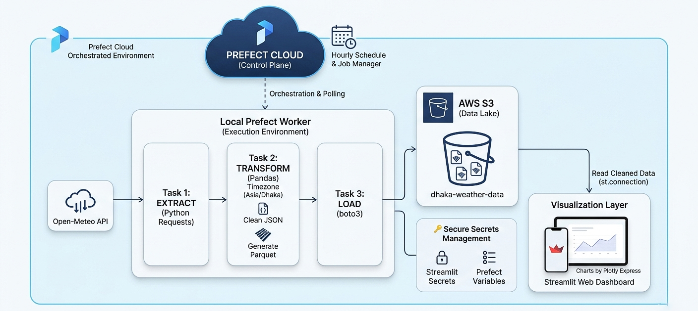

## 🏗️ Architecture

This pipeline follows a modular ETL (Extract, Transform, Load) pattern, orchestrated by Prefect Cloud for high reliability.

- **Extraction:**  
  An automated Python script fetches real-time weather data from the Open-Meteo API.

- **Transformation:**  
  Raw JSON data is processed using Pandas to ensure schema consistency. Key transformations include standardizing units (°C, km/h), localizing timestamps to Asia/Dhaka, and partitioning the data into Parquet format for high-performance cloud storage and cost-efficient querying.

- **Loading:**  
  The processed, high-performance dataset is pushed to an AWS S3 bucket (Data Lake).

- **Visualization:**  
  A live Streamlit application fetches the Parquet files from S3 and renders interactive insights using Plotly.

---

## 🛠️ Tech Stack

- **Language:** Python
- **Orchestration:** Prefect Cloud
- **Cloud Infrastructure:** AWS S3  
- **Visualization:** Streamlit & Plotly